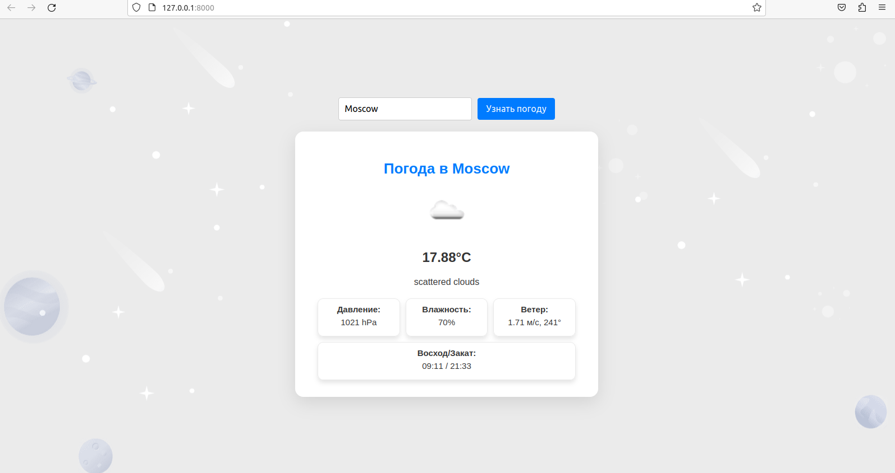
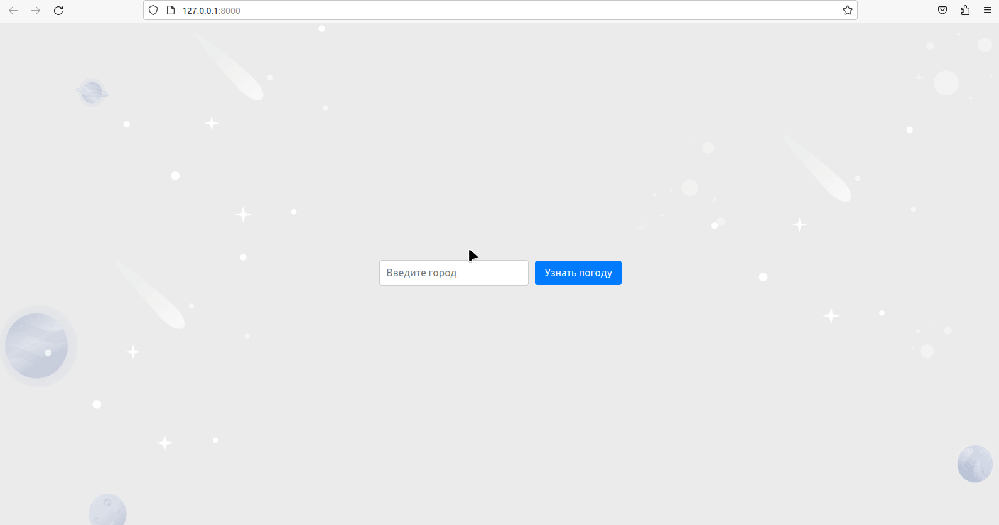

# Weather SPA

**Приложение выполнено в рамках тестового задания**

## Что это за приложение?

*Weather SPA -  это приложение, которое позволяет пользователям получать информацию о погоде*

## Основной функционал:
* Всё находится на одной странице.
* Населенный пункт для указания погоды передаётся через поле ввода формы.
* Для получения погоды используется API https://openweathermap.org/
* Кеширование погоды.

## UI 

|            |                                                          |
|------------|----------------------------------------------------------|
| screenshot |   |
| gif        |  |

## Использованные технологии

* Laravel 10
* Php 8
* Vue.js 
* Vite
* Mysql

## Сборка и запуск
* node >=14, 
* compose install
* php artisan migrations
* npm install
* npm run dev
* php artisan serve

## Настройка .env
* ключ для openweathermap 
*  weather database в mysql

